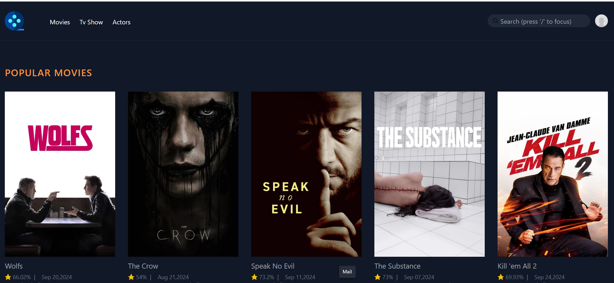

### Installation
1. **Clone the repositoyr**
```bash 
git clone https://github.com/kyawzinkoko-dev/MovieApp
```
2. **Copy .env.example**
```bash 
cp .env.example .env
```
3. **Generate application key**
```bash
php artisan key:generate
```
4. **Run the application**
```bash 
php artisan serve 
```
<h1>Movie App with  larael</h1>
<strong>Features</strong>
<ul><li>
    Search for any movie in search bar
</li>
<li>see the detail of the movie</li>
<li>search any series by popular</li>
<li>Search Any popular actors</li>
<li>Play trailer of the movies and series</li></ul>
<h2>Tools </h2>
    <ul>
    <li>Infinite scroll actor infinite scroll</li> 
    <li>Live wire for seach and search result</li>
    <li>Tailwind css for styling </li>
    <li>view model package for better and clean code blade view</li>
    <li>TMDB database for movie data</li>
    </ul>
